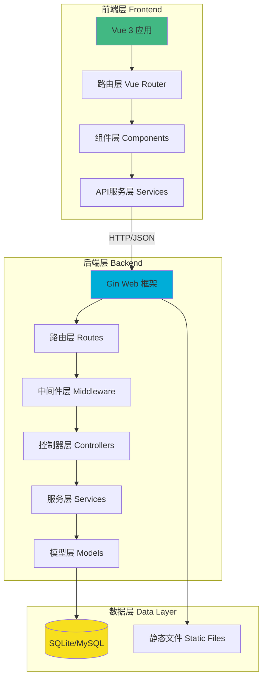
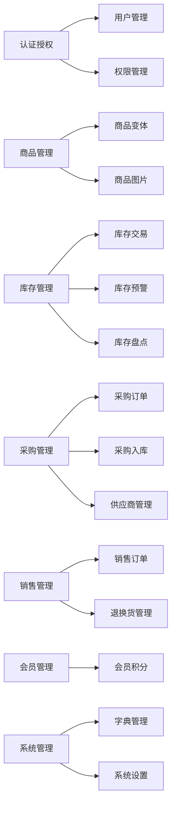
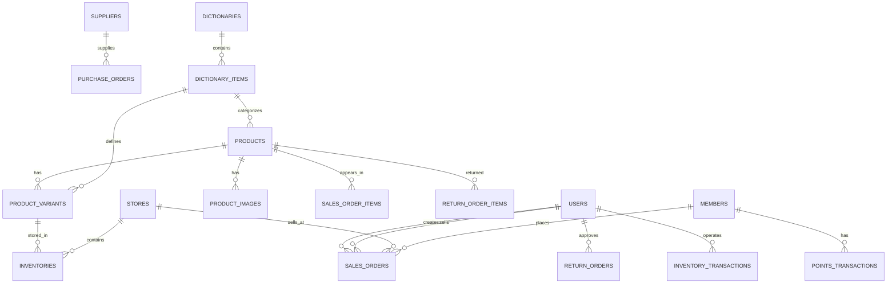
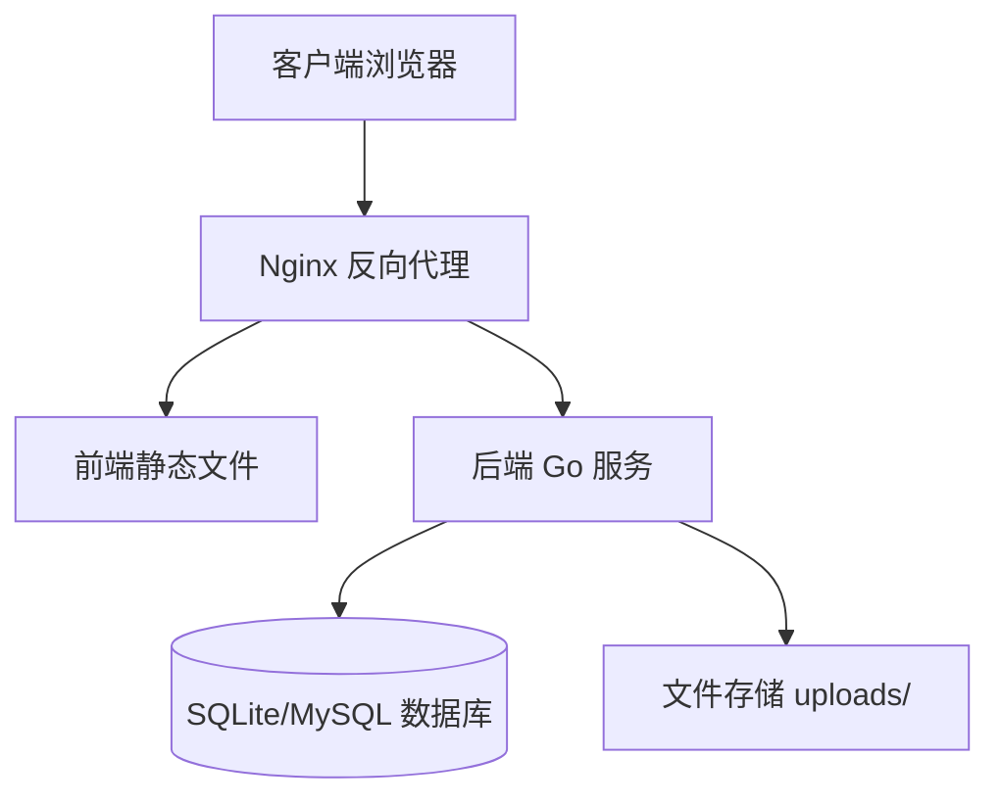

# HD-PSI 服装进销存系统 - 架构技术文档

## 1. 项目概述

### 1.1 项目简介
HD-PSI（服装进销存系统）是一个基于 Go + Vue 3 的全栈服装行业进销存管理系统，支持商品管理、库存管理、采购管理、销售管理、会员管理、退换货管理等核心业务功能。

### 1.2 技术栈

| 层级 | 技术选型 | 版本 |
|------|---------|------|
| 后端框架 | Gin | v1.10.0 |
| 后端语言 | Go | 1.24.0 |
| ORM | GORM | v1.25.12 |
| 数据库 | SQLite / MySQL | - |
| 前端框架 | Vue | v3.5.13 |
| 构建工具 | Vite | v6.2.0 |
| UI组件库 | Naive UI | v2.41.0 |
| 路由 | Vue Router | v4.5.0 |
| HTTP客户端 | Axios | v1.8.4 |
| API文档 | Swagger | - |
| 认证 | JWT | - |

---

## 2. 系统架构

### 2.1 整体架构图



### 2.2 后端架构

#### 2.2.1 目录结构

```
backend/
├── config/           # 配置管理
│   ├── config.go
│   ├── config.yaml
│   └── config-sqlite.yaml
├── controllers/      # 控制器层（处理HTTP请求）
│   ├── auth_controller.go
│   ├── product_controller.go
│   ├── inventory_controller.go
│   ├── sales_order_controller.go
│   ├── return_controller.go
│   └── ...
├── models/          # 数据模型层（数据库实体）
│   ├── product.go
│   ├── inventory.go
│   ├── sales_order.go
│   ├── return_order.go
│   ├── user.go
│   └── ...
├── services/        # 业务逻辑层
│   ├── auth_service.go
│   ├── return_service.go
│   └── user_init_service.go
├── middleware/      # 中间件
│   ├── auth_middleware.go
│   ├── cors_middleware.go
│   ├── api_version.go
│   └── error_handler.go
├── routes/          # 路由配置
│   ├── routes.go
│   ├── file_routes.go
│   └── product_image_routes.go
├── utils/           # 工具类
│   ├── logger/
│   ├── errors/
│   ├── jwt.go
│   └── password.go
├── migrations/      # 数据库迁移文件
├── docs/           # Swagger API文档
├── embed/          # 嵌入的静态文件
└── main.go         # 应用入口
```

#### 2.2.2 分层架构说明

| 层级 | 职责 | 说明 |
|------|------|------|
| **路由层** | 请求路由 | 定义API端点，将请求分发到对应的控制器 |
| **中间件层** | 横切关注点 | 处理认证、授权、CORS、日志、错误处理等 |
| **控制器层** | 请求处理 | 接收HTTP请求，参数验证，调用服务层，返回响应 |
| **服务层** | 业务逻辑 | 实现核心业务逻辑，事务管理 |
| **模型层** | 数据访问 | 定义数据结构，数据库操作 |

### 2.3 前端架构

#### 2.3.1 目录结构

```
fronted/
├── src/
│   ├── views/           # 页面视图
│   │   ├── Dashboard.vue
│   │   ├── ProductList.vue
│   │   ├── ProductFormNew.vue
│   │   ├── SalesOrderList.vue
│   │   └── ...
│   ├── components/     # 可复用组件
│   │   ├── AppLayout.vue
│   │   ├── PageHeader.vue
│   │   ├── ProductImageUpload.vue
│   │   └── permission/
│   ├── router/         # 路由配置
│   │   └── index.js
│   ├── services/       # API服务
│   │   ├── api.js      # Axios实例配置
│   │   ├── auth.js     # 认证服务
│   │   ├── product.js  # 商品API
│   │   └── ...
│   ├── composables/    # 组合式函数
│   │   └── useTheme.js
│   ├── assets/         # 静态资源
│   │   └── css/
│   ├── App.vue         # 根组件
│   └── main.js         # 应用入口
├── public/             # 公共静态文件
├── index.html
├── package.json
└── vite.config.js
```

#### 2.3.2 前端架构说明

| 层级 | 职责 | 说明 |
|------|------|------|
| **路由层** | 页面导航 | Vue Router管理页面路由和导航守卫 |
| **视图层** | 页面组件 | 各业务页面的Vue组件 |
| **组件层** | UI组件 | 可复用的UI组件 |
| **服务层** | API调用 | 封装后端API调用，统一请求/响应处理 |
| **状态管理** | 应用状态 | 使用组合式函数管理状态 |

---

## 3. 核心功能模块

### 3.1 功能模块图



### 3.2 模块详细说明

#### 3.2.1 认证授权模块

| 功能 | 说明 |
|------|------|
| 用户登录 | 用户名密码登录、微信登录 |
| JWT认证 | 基于JWT的令牌认证机制 |
| 角色权限 | admin、manager、staff、cashier、operator |
| 路由守卫 | 前端路由权限控制 |
| 中间件 | 后端API权限验证 |

#### 3.2.2 商品管理模块

| 功能 | 说明 |
|------|------|
| 商品CRUD | 商品的增删改查 |
| 商品变体 | 支持颜色、尺码、季节、面料等变体 |
| 商品图片 | 支持多图上传和管理 |
| 商品分类 | 基于字典的商品分类 |
| 软删除 | 支持商品删除和恢复 |

#### 3.2.3 库存管理模块

| 功能 | 说明 |
|------|------|
| 库存查询 | 按店铺、商品查询库存 |
| 库存交易 | 记录库存变动历史 |
| 库存预警 | 低库存预警机制 |
| 库存盘点 | 定期盘点和调整 |

#### 3.2.4 销售管理模块

| 功能 | 说明 |
|------|------|
| 销售订单 | 线上/线下订单管理 |
| 订单状态 | 草稿、待确认、已确认、已付款、已发货、已完成等 |
| 支付管理 | 支持多种支付方式 |
| 试衣管理 | 试衣间和试衣记录 |
| 议价管理 | 议价记录和审批 |

#### 3.2.5 退换货管理模块

| 功能 | 说明 |
|------|------|
| 退货申请 | 客户发起退货申请 |
| 换货申请 | 客户发起换货申请 |
| 审批流程 | 管理员审批退换货 |
| 退款处理 | 退款金额和方式管理 |
| 换货发货 | 换货商品发货管理 |

#### 3.2.6 会员管理模块

| 功能 | 说明 |
|------|------|
| 会员信息 | 会员基本信息管理 |
| 会员积分 | 积分增减和等级计算 |
| 积分交易 | 积分变动历史记录 |

---

## 4. 数据库设计

### 4.1 核心数据表

| 表名 | 说明 | 关键字段 |
|------|------|---------|
| `psi_users` | 用户表 | id, username, password, role, store_id |
| `psi_products` | 商品表 | id, sku, name, category_id, brand_id |
| `psi_product_variants` | 商品变体表 | id, product_id, sku, color_id, size_id |
| `psi_product_images` | 商品图片表 | id, product_id, url, sort |
| `psi_inventories` | 库存表 | id, store_id, product_variant_id, quantity |
| `psi_inventory_transactions` | 库存交易表 | id, type, quantity, reason |
| `psi_sales_orders` | 销售订单表 | id, order_number, status, total_amount |
| `psi_sales_order_items` | 销售订单明细表 | id, sales_order_id, product_id, quantity |
| `psi_return_orders` | 退换货订单表 | id, return_no, type, status |
| `psi_return_order_items` | 退换货明细表 | id, return_order_id, product_id, quantity |
| `psi_members` | 会员表 | id, name, phone, points |
| `psi_suppliers` | 供应商表 | id, name, contact, phone |
| `psi_purchase_orders` | 采购订单表 | id, order_number, supplier_id, status |
| `psi_dictionaries` | 字典类型表 | id, code, name |
| `psi_dictionary_items` | 字典项表 | id, dictionary_code, code, name |

### 4.2 数据库关系图



---

## 5. API设计

### 5.1 API版本控制

- 基础路径：`/api/v1`
- 版本前缀可通过配置启用/禁用

### 5.2 认证机制

- 使用 JWT（JSON Web Token）进行认证
- 请求头格式：`Authorization: Bearer <token>`
- 支持令牌刷新机制

### 5.3 统一响应格式

```json
{
  "code": 20000,
  "message": "success",
  "data": {}
}
```

### 5.4 主要API端点

| 模块 | 端点 | 方法 | 说明 |
|------|------|------|------|
| 认证 | `/api/v1/auth/login` | POST | 用户登录 |
| 认证 | `/api/v1/auth/refresh-token` | POST | 刷新令牌 |
| 商品 | `/api/v1/products` | GET | 获取商品列表 |
| 商品 | `/api/v1/products` | POST | 创建商品 |
| 商品 | `/api/v1/products/:id` | GET | 获取商品详情 |
| 商品 | `/api/v1/products/:id` | PUT | 更新商品 |
| 商品 | `/api/v1/products/:id` | DELETE | 删除商品 |
| 库存 | `/api/v1/inventory` | GET | 获取库存列表 |
| 销售 | `/api/v1/sales` | GET | 获取销售订单 |
| 销售 | `/api/v1/sales` | POST | 创建销售订单 |
| 退换货 | `/api/v1/returns` | GET | 获取退换货列表 |
| 退换货 | `/api/v1/returns` | POST | 创建退换货申请 |
| 会员 | `/api/v1/members` | GET | 获取会员列表 |
| 会员 | `/api/v1/members/:id/points` | GET | 获取会员积分 |

---

## 6. 安全机制

### 6.1 认证安全

| 机制 | 说明 |
|------|------|
| 密码加密 | 使用 bcrypt 加密存储密码 |
| JWT令牌 | 使用 HS256 签名算法 |
| 令牌过期 | 访问令牌24小时，刷新令牌7天 |
| 登录限制 | 失败次数限制和账户锁定 |

### 6.2 授权控制

| 机制 | 说明 |
|------|------|
| 角色权限 | 基于角色的访问控制（RBAC） |
| 路由守卫 | 前端路由权限验证 |
| API中间件 | 后端API权限验证 |
| 操作日志 | 记录关键操作审计日志 |

### 6.3 数据安全

| 机制 | 说明 |
|------|------|
| SQL注入防护 | 使用 GORM 参数化查询 |
| XSS防护 | 前端输入验证和转义 |
| CORS配置 | 可配置的跨域访问策略 |

---

## 7. 部署架构

### 7.1 部署方式



### 7.2 Docker部署

项目包含 `docker-compose.yml` 配置文件，支持容器化部署。

### 7.3 配置管理

- 配置文件：`backend/config/config.yaml`
- 环境变量：支持通过环境变量覆盖配置
- 配置项：服务器、数据库、JWT、日志、CORS等

---

## 8. 开发规范

### 8.1 代码规范

| 规范 | 说明 |
|------|------|
| Go代码 | 遵循 Go 官方代码规范 |
| Vue代码 | 遵循 Vue 3 风格指南 |
| 命名规范 | 驼峰命名法，语义化命名 |
| 注释规范 | 关键函数和复杂逻辑添加注释 |

### 8.2 Git工作流

- 主分支：`main`
- 开发分支：`develop`
- 功能分支：`feature/xxx`
- 修复分支：`fix/xxx`

### 8.3 API文档

使用 Swagger 自动生成 API 文档，访问地址：`/swagger/index.html`

---

## 9. 扩展性设计

### 9.1 数据库扩展

- 支持 SQLite 和 MySQL 两种数据库
- 通过配置文件切换数据库类型
- 支持自动迁移和手动迁移

### 9.2 功能扩展

- 模块化设计，易于添加新功能
- 字典管理支持动态配置
- 插件式中间件架构

### 9.3 前端扩展

- 组件化设计，可复用组件库
- 组合式函数，逻辑复用
- 路由懒加载，按需加载

---

## 10. 附录

### 10.1 环境要求

| 组件 | 要求 |
|------|------|
| Go | 1.24.0+ |
| Node.js | 16+ |
| 数据库 | SQLite 3 或 MySQL 5.7+ |

### 10.2 启动命令

```bash
# 后端启动
cd backend
go run main.go

# 前端启动
cd fronted
npm run dev

# 构建前端
npm run build
```

### 10.3 相关文档

- [后端API文档](/swagger/index.html)
- [产品图片上传指南](docs/product_image_upload_guide.md)
- [数据库迁移文件](backend/migrations/)

---

**文档版本**: v1.0  
**最后更新**: 2025-12-23  
**维护者**: HD-PSI 开发团队